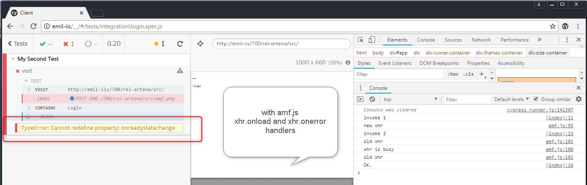
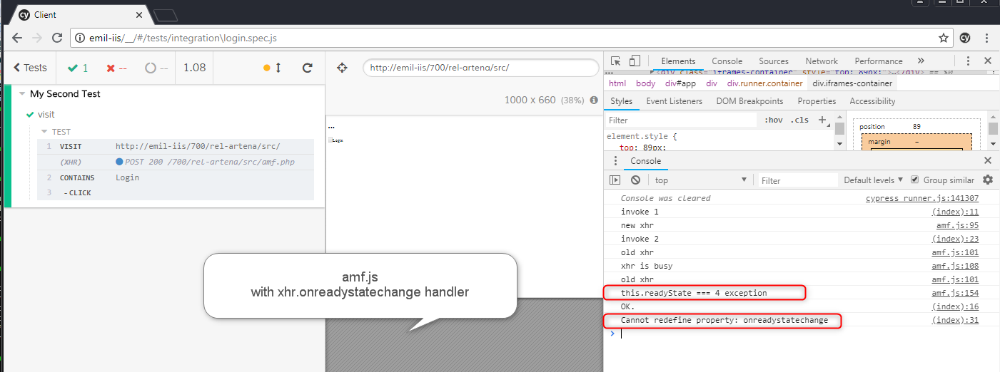

# cypress-readystatechange

This is intended to try and replicate the following cypress issue https://github.com/cypress-io/cypress/issues/599

In this case, amf.js a stripped down version of amfjs has been used. Removing all the AMF stuff and just leaving the xhr pool.

It seems that when an xhr is reused it causes the cypress issue.

The error appears on the left in the application under development. In this replication dedicated code we have two versions of xhr handling, with onreadystatechange, and onload, onerror. Both failing.

Hopefully this helps.